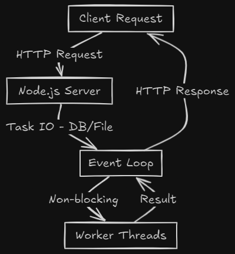

---
# 🟩 **Day 1: What is Node.js and Why is it Used?**

---
## 📘 Definition: What is Node.js?

> **Node.js** is a **runtime environment** that lets you run JavaScript **outside the browser** – on the **server**.

It uses **Google Chrome's V8 JavaScript engine** to execute code and provides additional modules to handle things like file systems, servers, streams, etc.

---
## 💡 Why Was Node.js Created?

Before Node.js, JavaScript could only run **inside browsers** (like Chrome, Firefox).

Developers wanted to:

- Use **JavaScript for backend development**
    
- Write **server-side logic** (like database interaction, API handling)
    
- Use **one language (JS)** across full-stack development

Node.js made that possible. 🚀

---
## ⚙️ How Node.js Works Internally

### ✅ 1. **V8 Engine** — Think of it like a **translator**

- **What it does:** Converts JavaScript into **machine code** (so your computer can execute it).
    
- **Why it's important:** It makes Node.js **fast** and **efficient**.

🧠 **Real-Life Analogy:**

> Imagine reading an English book in Germany. You need a **translator** (V8) who instantly converts English to German **so you can act**.

📌 V8 is built by Google and is also used in **Chrome**.

### ✅ 2. **Single-threaded Architecture** — Only **one task** at a time (sort of...)

- Node.js has **just 1 main thread** (like one lane) for processing **JavaScript code**.
    
- But Node **doesn’t block** the road when doing heavy tasks like reading files or querying databases.

🧠 **Real-Life Analogy:**

> You’re a chef with **1 pair of hands** (main thread). When you boil pasta (file reading), you **set a timer** and start chopping veggies in the meantime (continue other JS code).

### ✅ 3. **Event Loop + Non-blocking I/O** — The magic

- When Node.js faces a **slow operation** (like reading from a DB or file):
    
    - It **doesn't wait**
        
    - It **delegates** the task to **libuv’s thread pool** (background workers)
        
    - And **moves on** to the next line of code
        
    - Once the background task is done, **event loop** puts it back in the queue

🧠 **Real-Life Analogy:**

> You order food at a restaurant. The waiter **takes your order and moves on**, instead of waiting in the kitchen for it to finish.

---
